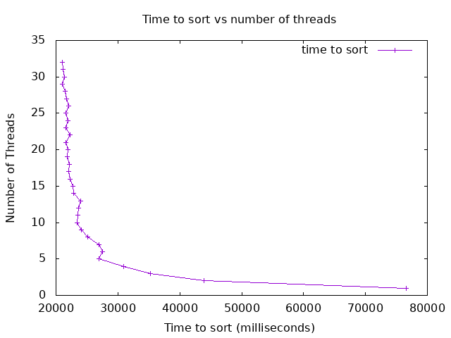

Task 6 - Complete the Analysis (ABET Outcome 1)

 ## Analysis

Were you able to generate something close to what the example showed? Why or why not.
Did you see a slow down at some point why or why not?

The graph I was able to create looked very similar to the one shown. I tested my code on the Boise State ONYX cluster. I did this because my local pc aswell as github codespaces only support up to 2 parallel threads. 
Onyx supports up to 32 seperate threads, so I had a larger number of threads to work with than shanes Mac book. This explains the positive difference in performance on my tests compared to shanes loss of speed starting around 9 threads which seemed to be the limit for for his M1 Macbook. where in my case Onyx still had plently of free threads so my graph continued to speed up linearly positive with some small deviation up until 32 threads running in parallel. There were some marginal slow downs, I would attribute to the load of other students working in the labs on the cluster. If I were to test it again perhaps running it very early or late perhaps I could get a faster performance.

Did your program run faster and faster when you added more threads? Why or why not?

Yes the program continued to speed up as more threads were added, I think for the ONYX system a larger upper limit than 32 threads would have been a better test but would take alot of time.

What was the optimum number of threads for your machine?

32

What was the slowest number of threads for your machine?

1 thread. The greatest increase was from 1 thread to 2 nearly doubling perfomance.

If your graph does not look like the example graph you will need to explain why, maybe go back and look at your original implementation, 
did you make a mistake somewhere? If you found a bug in your original implementation please note that and explain what you fixed 😃.
